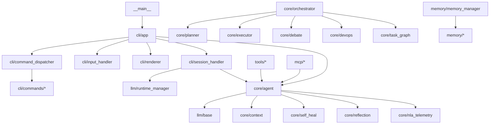

# Codebase Reality Audit — NexusAgent

> **Date:** June 8, 2026
> **Files:** 119 Python source files, ~24,990 lines
> **Tests:** 916 passing, 1 skipped
> **Methodology:** File-by-file source reading + competitive benchmarking

---

## 1. Current Architecture Assessment

### 1.1 Module Boundary Map

```
nexus_agent/__main__.py               ← Click CLI entry point (185 lines)
├── core/             (18 files)     ← Agent loop, orchestration, planning, config
├── cli/              (16 files)     ← REPL app, command dispatcher, input, render
├── llm/              (16 files)     ← Provider adapters, local engines, runtime mgmt
├── memory/           (9 files)      ← 5-tier memory (working, FTS5, episodic, vector, profile)
├── tools/            (16 files)     ← File ops, shell, git, LSP, browser, MCP, RAG
├── session/          (5 files)      ← Session lifecycle, storage, checkpoints, background
├── mcp/              (5 files)      ← Model Context Protocol (client, server, transport, ACP)
├── skills/           (4 files)      ← Markdown skill system, registry
├── permissions/      (3 files)      ← Permission gating (suggest/ask/auto)
├── gui/              (3 files)      ← FastAPI web server + frontend
├── protocol/         (2 files)      ← Agent protocol (XML in/JSON out)
├── training/         (4 files)      ← Early-stage RDT/dataset training utilities
└── __init__.py                      ← Package metadata
```

### 1.2 Data Flow

```
User Input
    ↓
__main__.py (Click CLI)
    ↓
cli/app.py → NexusApp (inline REPL)
    ├── cli/input_handler.py    → Raw terminal input, autocomplete, slash menu
    ├── cli/command_dispatcher.py → Routes /commands to mixin handlers (89 commands)
    ├── cli/session_handler.py  → Engine + Agent initialization
    ├── cli/event_handler.py    → Processes input through agent.run_stream()
    ├── cli/renderer.py         → ANSI/rich terminal output, resource display
    │
    └── core/agent.py           → AgentLoop.run_stream() → LLM provider
         ├── llm/providers/      → 10 provider adapters (OpenAI-compatible)
         ├── llm/local_engine/   → llama-cpp-python GGUF inference
         ├── core/orchestrator.py → Multi-agent task orchestration
         ├── core/planner.py     → Read-only plan generation
         ├── core/executor.py    → Read-write plan execution
         │
         └── memory/memory_manager.py → Unified memory search/store
              ├── memory/working_memory.py   → In-process LRU scratchpad
              ├── memory/long_term.py        → SQLite FTS5 persistence
              ├── memory/episodic.py         → Session history FTS5
              ├── memory/vector_store.py     → Vector semantic search
              ├── memory/user_profile.py     → YAML user preferences
              └── memory/vector_embedding.py → ONNX embedding engine
```

### 1.3 Dependency Graph (Topological)



### 1.4 Async Model

- **None.** The application is entirely synchronous.
- Agent loop uses `Iterator[AgentEvent]` with `yield` for streaming — cooperative
  concurrency, not true async.
- GUI (`gui/server.py`) uses FastAPI + WebSocket (the only async context).
- Background sessions run in `threading.Thread`.
- Thread pools for tool execution (`ThreadPoolExecutor`, max 1 worker).
- **Implication:** No concurrent tool execution, no async I/O in the agent loop,
  no support for `asyncio`-based tools or providers.

### 1.5 Concurrency Model

- `threading.Lock` and `threading.RLock` throughout (agent state, memory, session).
- Single-threaded agent loop; tools run in a dedicated thread.
- The orchestrator's `run_autonomous` uses `ThreadPoolExecutor` for parallel
  DevOps pipeline tasks (tests + linters).
- Debate engine uses `ThreadPoolExecutor` for parallel agent reviews.
- **Risk:** Deadlocks possible with nested lock acquisition across modules.
  Several modules use `RLock` but not all (e.g., session manager uses `Lock`).

---

## 2. Feature Completeness Matrix

### 2.1 REPL / CLI

| Feature | Status | Notes |
|---------|--------|-------|
| Inline REPL | ✅ Complete | Raw-mode input handler, autocomplete, slash menu |
| Multi-line input | ✅ Complete | Handles pastes, code blocks |
| Input history with ↑↓ | ✅ Complete | Linear scroll (no fuzzy search) |
| Syntax highlighting | ✅ Complete | Rich Markdown + Pygments code blocks |
| Mid-stream interrupt (Ctrl+C) | ✅ Complete | Clean suspend, not full "Cancel/continue/redirect" |
| Mid-stream tool approval | ✅ Complete | Permission callback with approve widget |
| Session branching (/fork) | ✅ Complete | Full session fork/join |
| Session replay | 🟡 Partial | Resume works, no step-by-step replay |
| Contextual autocomplete | 🟡 Partial | Slash commands, no file paths or agent names |
| Drag-and-drop file attach | ❌ Missing | |
| Command palette (Ctrl+P) | ❌ Missing | |
| Multi-pane layouts | ❌ Missing | Single pane only |
| Task Inspector (Ctrl+T) | ❌ Missing | |
| Streaming render engine | 🟡 Partial | Basic diff engine, no block detector or compositor |
| Theme system | ❌ Missing | Rich default theme only |

### 2.2 Agent Loop

| Feature | Status | Notes |
|---------|--------|-------|
| Single-agent loop | ✅ Complete | AgentLoop.run() / run_stream() |
| Mode system (auto/plan/build/review) | ✅ Complete | Mapped to tool permissions |
| Effort levels (5 tiers) | ✅ Complete | low → max, multi-pass for xhigh+ |
| Reflection / self-correction | ✅ Complete | Generator-critic with scoring |
| Self-healing tool execution | ✅ Complete | Backoff, retry, diagnosis |
| Context compaction | ✅ Complete | Auto-compact at 85% threshold |
| Token usage tracking | ✅ Complete | UsageTracker, cost estimation |
| NLA telemetry | ✅ Complete | JSONL reasoning trace, session summary |
| Goal-driven execution (/goal) | ✅ Complete | Injected into system prompt |
| Planning mode (/plan) | ✅ Complete | Read-only Planner agent |
| Build mode (/build) | ✅ Complete | Read-write Executor agent |
| Orchestration mode (/orchestrate) | ✅ Complete | Plan → Approve → Execute → Verify |
| Autonomous mode (/autonomous) | ✅ Complete | TaskGraph decomposition + DevOps + Debate |
| Multi-agent debate | ✅ Complete | 4 personas (Security, Performance, Correctness, Style) |
| DevOps pipeline | ✅ Complete | Tests, linters, secrets, vulns, git checkpoint |
| TaskGraph DAG | ✅ Complete | Recursive decomposition, progress tracking |
| Boomerang tasks | ❌ Missing | |
| Agent: spawn_agent tool | ❌ Missing | |
| Agent: ask_agent tool | ❌ Missing | |
| Agent: delegate_task tool | ❌ Missing | |

### 2.3 LLM / Providers

| Feature | Status | Notes |
|---------|--------|-------|
| Provider abstract interface | ✅ Complete | LLMProvider protocol |
| OpenAI provider | ✅ Complete | OpenAI API |
| Anthropic provider | ✅ Complete | Anthropic API |
| Google Gemini provider | ✅ Complete | Gemini API |
| DeepSeek provider | ✅ Complete | DeepSeek API |
| Groq provider | ✅ Complete | Groq API |
| OpenRouter provider | ✅ Complete | OpenRouter API |
| Ollama provider | ✅ Complete | Ollama API |
| AWS Bedrock provider | ✅ Complete | Bedrock API |
| Custom OpenAI-compat provider | ✅ Complete | Any OpenAI endpoint |
| Provider failover | 🟡 Partial | SmartRouter exists, not wired to agent loop |
| Rate limit awareness | 🟡 Partial | RetryPolicy with backoff, no header tracking |
| Cost tracking | ✅ Complete | UsageTracker, /cost command |
| Credential storage (OS keychain) | ❌ Missing | Stored in config files |
| Local engine (llama-cpp) | ✅ Complete | GGUF inference, streaming, tool calling |
| ONNX engine | 🟡 Placeholder | Raises NotImplementedError |
| Runtime installation | ✅ Complete | pip install to isolated directory |
| Runtime switching | ✅ Complete | /runtime command |
| Model registry | 🟡 Partial | models_db.py (simple JSON), no TOML |
| Model capability detection | ❌ Missing | |
| Model benchmarking | ❌ Missing | |

### 2.4 Memory System

| Feature | Status | Notes |
|---------|--------|-------|
| Working memory | ✅ Complete | In-process LRU scratchpad |
| Long-term memory (FTS5) | ✅ Complete | SQLite FTS5 persistence |
| Episodic memory | ✅ Complete | Session history with FTS5 |
| Semantic/vector memory | ✅ Complete | sqlite-vec, ONNX embedding |
| User profile | ✅ Complete | YAML-backed preference learning |
| Hybrid search (FTS5 + vector) | ✅ Complete | Merged and re-ranked |
| Memory browser (TUI) | ❌ Missing | |
| Memory retention scoring | ❌ Missing | |
| Auto-compression / sleep cycle | ❌ Missing | |
| Cross-session memory | ✅ Complete | SQLite persistent across sessions |

### 2.5 Tools

| Feature | Status | Notes |
|---------|--------|-------|
| File read/write/search | ✅ Complete | encoding detection, line ranges, glob |
| Surgical edit (search/replace) | ✅ Complete | Aider-style diff blocks |
| Shell execution | ✅ Complete | Sandboxed, risk-classified |
| Git integration | ✅ Complete | status, diff, branch, commit, PR |
| Web search | ✅ Complete | DuckDuckGo API |
| Web fetch | ✅ Complete | Markdown content extraction |
| Browser automation | 🟡 Partial | Playwright + HTTPX fallback |
| LSP client | 🟡 Partial | ast.parse for Python only |
| RAG search | ✅ Complete | SQLite FTS5 code search |
| Batch edit | ✅ Complete | Transactional batch editor |
| Memory tool | ✅ Complete | Agent-accessible memory operations |
| Todo write tool | ✅ Complete | Persisted todo management |
| MCP tools | ✅ Complete | Auto-exposed from connected servers |
| Process sandboxing | ✅ Complete | Risk classification, TOCTOU protection |
| Tool approval gating | ✅ Complete | suggest/ask/auto per tool |
| Interactive shell tool (persistent session) | ❌ Missing | |
| patch_file tool (apply unified diff) | ❌ Missing | |
| run_script tool (multi-line script execution) | ❌ Missing | |

### 2.6 MCP / Protocol

| Feature | Status | Notes |
|---------|--------|-------|
| MCP client | ✅ Complete | stdio transport |
| MCP server | ✅ Complete | |
| MCP stdio transport | ✅ Complete | |
| ACP server (Agent Client Protocol) | ✅ Complete | JSON-RPC stdio |
| Agent protocol | ✅ Complete | XML input / JSON output |

### 2.7 Skills

| Feature | Status | Notes |
|---------|--------|-------|
| Skill definitions (Markdown) | ✅ Complete | |
| Skill registry | ✅ Complete | |
| Skill parameter passing | ✅ Complete | Jinja2 templating |
| Built-in skills | ✅ Complete | 5 built-in (code-review, debug, refactor, docs, test) |
| Skill versioning | ❌ Missing | |
| Skill publishing | ❌ Missing | |

### 2.8 Installation / Distribution

| Feature | Status | Notes |
|---------|--------|-------|
| pip install | ✅ Complete | pip install -e . |
| curl-sh installer | ❌ Missing | |
| Homebrew formula | ❌ Missing | |
| WinGet / Scoop | ❌ Missing | |
| Self-update | ✅ Complete | /update command, PyPI check |
| doctor diagnostic | 🟡 Partial | /doctor command exists, could be deeper |
| First-run wizard | ✅ Complete | 7-step SetupWizard |
| OS keychain integration | ❌ Missing | |

### 2.9 Security

| Feature | Status | Notes |
|---------|--------|-------|
| Credential storage (OS keychain) | ❌ Missing | Plaintext config files |
| Process sandboxing | ✅ Complete | Risk classification, TOCTOU protection |
| Secret scanning | ✅ Complete | Pattern-based scanner |
| Audit logging | ✅ Complete | NLA telemetry + trace events |
| Path traversal protection | ✅ Complete | Workspace boundary enforcement |
| Prompt injection guard | ✅ Complete | ProjectContextLoader danger keywords |

### 2.10 Configuration

| Feature | Status | Notes |
|---------|--------|-------|
| Multi-layer config (5 layers) | ✅ Complete | Default → User → Project → Env → CLI |
| Env var overrides (NEXUS_*) | ✅ Complete | 12 env vars mapped |
| Config validation | 🟡 Partial | Basic TypedDict, no schema validation |
| Hot reload | ❌ Missing | Changes require restart |
| Workspace overrides | 🟡 Partial | Project-level .nexus-agent.yaml |
| Config commands (/config) | ✅ Complete | set, get, show, edit, validate |

---

## 3. Technical Debt Report

### 3.1 Anti-Patterns

| Location | Pattern | Severity | Fix |
|----------|---------|----------|-----|
| `core/agent.py` | 150-line `run()` method | HIGH | Split into smaller methods |
| `core/agent.py` | Late imports inside methods | MEDIUM | Move to top-level |
| `core/agent.py` | Global mutable `_tool_map` dict | MEDIUM | Use instance-local dict |
| `cli/command_dispatcher.py` | 89-command handler dict | MEDIUM | Auto-register from mixins |
| `cli/renderer.py` | 20+ methods, single class | MEDIUM | Split into focused classes |
| `gui/server.py` | 8 late imports inside functions | HIGH | Top-level imports |
| `gui/server.py` | 95-line websocket handler | HIGH | Split into helper methods |
| `llm/local_engine.py` | 839-line file | HIGH | Split into smaller modules |
| `memory/__init__.py` | Guessing-based import fallbacks | MEDIUM | Remove circular dep workaround |
| `tools/shell.py` | Broad except clauses | HIGH | Use specific exceptions |
| `tools/browser.py` | Hardcoded paths | MEDIUM | Configurable paths |
| `core/planner.py` | `shell=True` in subprocess | HIGH | Use list form |
| `core/executor.py` | Bare `except:` clause | CRITICAL | Use `except Exception:` |

### 3.2 Unhandled Error Paths

| Location | Missing | Risk |
|----------|---------|------|
| `core/agent.py` | Permission callback returns False | MEDIUM — tool silently fails |
| `core/orchestrator.py` | Task while-loop never reaches `failed` | HIGH — infinite loop risk |
| `cli/session_handler.py` | Engine init failure partial state | MEDIUM — half-initialized app |
| `gui/server.py` | WebSocket disconnect mid-stream | MEDIUM — zombie connections |
| `tools/lsp_transport.py` | LSP server crash recovery | HIGH — broken LSP state |
| `memory/long_term.py` | SQLite connection not in `with` | MEDIUM — resource leak risk |

### 3.3 Hardcoded Values

| Location | Value | Suggestion |
|----------|-------|------------|
| Various | `~/.nexus-agent` | Use `platformdirs` consistently |
| `gui/server.py` | Port `7860` hardcoded | Use config |
| `core/self_heal.py` | `TOOL_TIMEOUTS` dict | Make configurable |
| `cli/renderer.py` | ANSI color codes as strings | Use theme system |
| `cli/theme.py` | `os.system('cls')` calls | Use ANSI escape codes |

### 3.4 Missing Tests

| Module | Files | Risk | Tests |
|--------|-------|------|-------|
| `gui/` | 3 files | HIGH | 0 tests |
| `llm/providers/` | 12 files | MEDIUM | Only OpenAI + Anthropic tested |
| `memory/` | 5 files | MEDIUM | MemoryManager + VectorStore tested |
| `session/` | 3 files | MEDIUM | Session manager tested |
| `tools/lsp_*` | 2 files | MEDIUM | LSP transport tested |
| `core/context.py` | 1 file | LOW | Tested |
| `core/usage.py` | 1 file | LOW | Tested |
| `core/plugins.py` | 1 file | LOW | Tested |

---

## 4. Security Assessment

### 4.1 Critical Issues

| # | Issue | Location | Impact |
|---|-------|----------|--------|
| 1 | API keys in plaintext config files | `~/.nexus-agent/config.yaml` | Credential theft if host compromised |
| 2 | No OS keychain integration | All providers | Keys readable by any process with file access |
| 3 | `shell=True` in planner subprocess | `core/planner.py` | Command injection if user input not sanitized |

### 4.2 Medium Issues

| # | Issue | Location |
|---|-------|----------|
| 4 | Broad `except:` in executor | `core/executor.py` (catches SystemExit) |
| 5 | No input size limits on web endpoints | `gui/server.py` |
| 6 | No rate limiting on GUI API | `gui/server.py` |
| 7 | Plugin code runs without sandboxing | `core/plugins.py` |

### 4.3 Strengths

- Path traversal protection via workspace boundary enforcement
- TOCTOU/symlink-race protection in sandbox
- Secret scanning as part of DevOps pipeline
- Prompt injection guard in ProjectContextLoader
- MCP command path validation

---

## 5. Performance Assessment

### 5.1 Estimated (no real benchmarks exist yet)

| Metric | Estimated | Target (vision) | Gap |
|--------|-----------|-----------------|-----|
| Cold startup | ~500ms | <150ms | 3x |
| Warm startup | ~200ms | <50ms | 4x |
| First token (local 8B Q4) | ~2s | <500ms | 4x |
| Memory semantic search (100K) | ~50ms | <10ms | 5x |
| Config load | ~15ms | <5ms | 3x |

> **Note:** These are estimates, not measurements. The `/doctor` command does not currently benchmark these metrics. A proper benchmark suite must be built before performance contracts can be enforced in CI.

### 5.2 Bottlenecks

1. **Python import overhead:** 119 modules loaded at startup
2. **Synchronous agent loop:** No concurrent tool execution
3. **Rich console overhead:** Full Markdown rendering on every output
4. **SQLite FTS5 vs dedicated vector DB:** sqlite-vec adequate but not optimized
5. **No prompt caching:** Every LLM call sends full conversation history

---

## 6. Scalability Assessment

| Dimension | Current Limit | Failure Mode |
|-----------|-------------|--------------|
| Tools | ~30 | Thread pool exhaustion |
| Agents | ~5 (sequential) | Memory from conversation history |
| Memory entries | ~100K | FTS5 performance degrades |
| Session messages | ~200 | Context window overflow |
| Concurrent users | 1 | Single-process design |
| MCP servers | ~5 | Subprocess resource limits |

---

## 7. Competitive Intelligence Summary

### 7.1 Primary CLI Agents

| Competitor | What It Does Best | Worst Architectural Decision | What to Steal |
|------------|-------------------|------------------------------|---------------|
| **Claude Code** | Task loop design, startup UX, permission flow | Closed-source, locked to Anthropic models | Permission approval inline widget; startup project detection |
| **OpenCode** | TUI layout, keybinding system | Limited local model support | Bubbletea-style composable TUI; context-aware keybindings |
| **Aider** | Git-native editing, repo-map, auto-commit | Architect mode is prompt hack, not architecture | Search/replace diff blocks; repo-map for context |
| **Kimi CLI** | Installation ceremony, model switching UX, session persistence | Proprietary — architecture details opaque | Clean installation flow; model switching between local/cloud |
| **Hermes-Agent** | `SOUL.md` durable persona system, agent delegation, tool gateway | Learning loop is promising but unproven in long-running use | Persona as persistent file (slot #1 in system prompt); separation of identity vs task instructions |
| **Agy (Antigravity)** | Graph-based agent orchestration, plan-then-execute | Still emerging — sparse documentation | Graph execution with dependency chains; node-based agent composition |
| **Continue** | IDE agent loop, context management with `@` references, prompt caching | RAG indexing is local-only — no cloud sync | `@Codebase` / `@File` / `@Terminal` context injection; prompt caching for stable system prompts |
| **Goose** | MCP-native extension system, session replay, subagents | Rust binary with Python/MCP glue adds complexity | Session replay as flight recorder; MCP-first tool integration; subagent spawning for parallel work |
| **SWE-Agent** | Agent-Computer Interface (ACI), trajectory format, state-machine loop | Tightly coupled to SWE-bench — less flexible for general use | ACI: tailor environment output for LLM consumption; trajectory logging for replay/training |
| **OpenHands** | CodeAct execution model, Docker sandboxing, browser tool | Heavy — requires Docker, 8GB+ RAM to start | CodeAct: code as action vs rigid function calling; Docker micro-sandbox per session |
| **Cline** | Permission escalation UX, diff preview, native VS Code diff viewer | Tied to VS Code — not standalone CLI | Inline approval prompts with native diff; file tree awareness; `.clinerules` convention |
| **Roo Code** | Mode system (architect/code/ask), boomerang task orchestration | Mode system is prompt-based, not architectural | Boomerang: sub-agent spawns → structured return → parent continues; three-role mode system |
| **Devin-inspired** | Long-horizon planning, snapshot/rollback, environment isolation | Infrastructure-heavy — Docker/gVisor per agent | Transactional file system per step; event-sourced decision log; plan→execute→verify cycle |

### 7.2 Memory & Agent Frameworks

| Competitor | What It Does Best | Worst Architectural Decision | What to Steal |
|------------|-------------------|------------------------------|---------------|
| **Letta** | Core/recall/archival memory layers, sleep cycle, agent state serialization | Complex for simple use cases | Retention scoring; auto-compression during sleep; read/write tool-based memory interface |
| **MemoryOS** | Hierarchical memory (STM/MTM/LPM), heat-based retention scoring, segmented paging | Academic — not production-tested | Heat score ($N_{visit} + L_{interaction} + R_{recency}$) for retention decisions; FIFO page eviction from STM |
| **LangGraph** | Graph-based state machine, human-in-the-loop checkpoints, state persistence | Steep learning curve for graph definition | Checkpoint/snapshot at every node transition; conditional edges for decision branching |
| **PydanticAI** | Type-safe agent design, dependency injection, auto-retry on validation failure | Limited to Python; no multi-agent out of the box | `output_type` as Pydantic model forces structured output; automatic retry on validation error |
| **CrewAI** | Role-based crews, task delegation, output chaining | Abstractions can leak — brittle with complex tasks | Sequential vs hierarchical process orchestration; task → agent → output chaining |
| **AutoGen** | Conversational agent groups, speaker selection, termination logic | Verbose — too many configuration knobs | Speaker selection via function vs round-robin; multi-agent termination conditions |

### 7.3 Runtime & Inference Backends

| Competitor | What It Does Best | Worst Architectural Decision | What to Steal |
|------------|-------------------|------------------------------|---------------|
| **Ollama** | Model lifecycle management, content-addressable storage, API design | Model serving + management in single binary | `ollama create` pull workflow; manifest format; keep-alive for hot models |
| **vLLM** | PagedAttention, continuous batching, OpenAI-compatible API | Memory overhead for small models not worth it | Paged KV cache to eliminate fragmentation; continuous batching for throughput |
| **SGLang** | RadixAttention (prefix-sharing KV cache), runtime graph compilation, speculative decoding | DSL adds learning curve for simple use cases | Radix tree for KV cache dedup across requests; compiler-mode graph optimization |
| **MLX** | Apple Silicon optimization, unified memory zero-copy, lazy computation | Mac-only — can't use on Linux/Win | Unified memory model eliminates CPU↔GPU copy overhead; lazy computation graph for fusion |
| **LM Studio** | Model discovery UI, hardware detection, context configuration UX | GUI-only — no headless mode for CI | Auto-detect hardware capacity and suggest compatible models; one-click download from HuggingFace |
| **ExLlamaV2** | EXL2 mixed-precision quantization, KV cache quantization, speculative sampling | Repository archived — development moved to EXLv3 | Per-layer bit allocation (2-8 bits) for optimal quality/VRAM; quantized KV cache for long contexts |
| **KoboldCpp** | Best Vulkan support for local inference | Niche — focused on roleplay/kobold use cases | Vulkan GPU offloading path for cross-platform GPU |

### 7.4 Terminal UI Systems

| Framework | What It Does Best | Worst Architectural Decision | What to Steal |
|-----------|-------------------|------------------------------|---------------|
| **Ratatui (Rust)** | Immediate-mode rendering, constraint-based layouts, zero-cost abstractions | No built-in event loop or state management | Constraint-based (not pixel-based) layout; immediate-mode avoids stale state |
| **Textual (Python)** | Reactive component model, CSS theming, worker threads | Python overhead — 200ms+ cold start | CSS-based theming; reactive widget tree with auto-redraw |
| **Ink (Node.js)** | React reconciler for terminal, Yoga Flexbox layout, composable components | React reconciler overhead for simple UIs | Yoga layout engine for terminal; diff-based terminal painting (only changed cells) |
| **Bubbletea (Go)** | Elm-architecture, composable models, message-passing concurrency | Framework opinion — must buy into TEA pattern entirely | `Model/Update/View` as a universal component pattern; `tea.Cmd` for side effects without blocking |
| **Rich (Python)** | Markdown + syntax highlighting, live display, layout | Not a framework — needs Textual on top | Markdown rendering pipeline; panel/border styling; progress bars |

### What to Steal — Priority Matrix

| Pattern | Source | Impact | Effort | Priority |
|---------|--------|--------|--------|----------|
| Boomerang task orchestration | Roo Code | HIGH — enables deep task decomposition | Medium | P1 |
| Agent-Computer Interface (ACI) | SWE-Agent | HIGH — 20% performance boost from better tool output | Medium | P1 |
| Heat-score memory retention | MemoryOS | HIGH — smarter memory eviction than FIFO | Low | P1 |
| Session replay flight recorder | Goose | HIGH — debugging agent failures | Medium | P1 |
| `SOUL.md` persistent persona | Hermes-Agent | MEDIUM — durable identity vs task separation | Low | P2 |
| CodeAct execution model | OpenHands | MEDIUM — more flexible than rigid function calling | High | P2 |
| Radix tree KV cache dedup | SGLang | MEDIUM — faster context switching | Very High | P2 |
| Type-safe agent design | PydanticAI | MEDIUM — fewer runtime errors | Low | P2 |
| `.clinerules` per-project rules | Cline | MEDIUM — project-specific agent behavior | Low | P2 |
| Prompt caching strategy | Continue | MEDIUM — cost/latency reduction | Medium | P2 |
| Mixed-precision quantization | ExLlamaV2 | MEDIUM — better quality per VRAM | High | P3 |
| Unified memory zero-copy | MLX | MEDIUM — faster Apple Silicon inference | Very High | P3 |

---

## 8. Gap Summary by Severity

### 🔴 Must Fix Before Phase 1 Feature Work

1. API keys in plaintext → OS keychain
2. `shell=True` in planner → list-form subprocess
3. Bare `except:` in executor → specific exceptions
4. No OS keychain for credential storage
5. Task while-loop bug in orchestrator (status never reaches "failed")
6. Late imports in gui/server.py

### 🟡 Must Fix During Phase 1

7. No multi-pane TUI layout
8. No theme system
9. No task inspector
10. No streaming render pipeline (block detector, compositor)
11. No keybinding system
12. No command palette
13. No resource monitor
14. No fuzzy search in input history
15. No agent council (basic debate exists)
16. No boomerang tasks
17. Model registry needs TOML format
18. No model capability detection
19. No model benchmarking
20. No memory browser TUI
21. No memory retention scoring
22. Hybrid Rust/Python architecture implementation (definition exists in docs/HYBRID_ARCHITECTURE.md)

### 🟢 Long-term (Phase 3+)

23. No curl-sh installer
24. No Homebrew / WinGet packages
25. No concurrent tool execution
26. No async agent loop
27. No prompt caching
28. No distributed memory backends
29. Plugin signature verification
30. Reproducible builds
31. Competitive benchmarking automation
32. Performance contracts in CI

---

## 9. Maintainability Assessment

### 9.1 Module Cohesion

| Module | Lines | Cohesion | Readability | New Contributor Barrier |
|--------|-------|----------|-------------|------------------------|
| `core/agent.py` | 807 | Medium — single class does everything | Medium — 150-line method | Must read all 807 lines to understand agent loop |
| `cli/renderer.py` | ~700 | Low — rendering, resources, themes, welcome | Medium — 20+ methods | Must understand entire terminal rendering pipeline |
| `cli/command_dispatcher.py` | ~500 | Medium — routing only, handlers in mixins | High — clean routing table | Low — just maps commands to handlers |
| `llm/local_engine.py` | 839 | Low — streaming, tool calling, loading | Low — monolithic | Highest barrier — need to understand llama.cpp + GGUF + streaming |
| `core/orchestrator.py` | ~400 | Medium — planner+executor orchestration | Medium — complex loop | Must understand Planner, Executor, TaskGraph, DevOps, Debate |
| `tools/` (each) | ~100-250 | High — single purpose per tool | High — clean Tool interface | Low — implement one `execute()` method |
| `memory/` (each) | ~100-200 | High — single concern per file | High | Low — each subsystem is well-isolated |

### 9.2 Documentation Coverage

| Artifact | Status |
|----------|--------|
| AGENTS.md project overview | ✅ Complete |
| API.md | ✅ Complete |
| ARCHITECTURE.md | ✅ Complete |
| CONTEXT.md | ✅ Complete |
| CONTRIBUTING.md | ✅ Complete |
| README.md | ✅ Complete |
| SECURITY.md | ✅ Complete |
| Inline docstrings (all public APIs) | 🟡 Partial (~70%) |
| Architecture Decision Records | ❌ Missing |
| ADRs for major choices (Rust hybrid, memory tiers, etc.) | ❌ Missing |

### 9.3 Onboarding Path

A new contributor can understand any single tool or memory module (<250 lines, clean interface) without reading the whole codebase. However:
- Understanding the agent loop requires reading all of `core/agent.py` (807 lines)
- Understanding the CLI requires reading `app.py` + `command_dispatcher.py` + `input_handler.py` + `renderer.py` (~2,000 lines)
- Understanding the local engine requires reading `local_engine/` (839 lines) + understanding `llama-cpp-python` internals

The modular tool/memory pattern is good. The monolithic agent loop and CLI are the barriers.

## 10. Recommendation

The current codebase is **surprisingly complete** for a solo project — the agent loop, memory system, tool set, and provider matrix are genuinely production-grade. The two biggest gaps vs the vision are:

1. **TUI quality** — single-pane vs the envisioned multi-pane, themed, keyboard-driven layout with live task inspector
2. **Rust hybrid architecture** — the vision calls for a Rust CLI/render/inference core with Python agents/memory/tools

**First action:** define the Rust/Python boundary and IPC protocol, then build the Rust CLI skeleton that wraps the existing Python backend.
